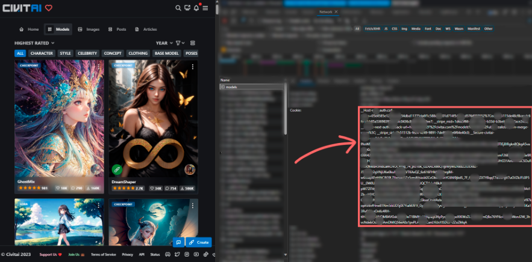

# civitai-generation

This is not an interpretation of the available API, but access to the generation of images thanks to the capabilities of the site.

**Please use with respect, site resources are limited.**

## Installing
```
pip install git+https://github.com/Lorg0n/civitai-generation-lib/
```

## Usage
```python
from civitai import civitai

cookie = "" # insert your cookie here
api = civitai.Civitai(cookie)

lora = api.get_additional_resources("makima")[0]
lora.set_strength(0.7)

resources = [api.get_checkpoints("OrangeMixs")[0], lora]
params = {
        "prompt": "1girl, makima",
        "negativePrompt": "EasyNegative,sketch,duplicate,ugly,huge eyesm, nsfw",
        "cfgScale": 5.5,
        "sampler": "DPM++ 2M Karras",
        "seed": 372223333,
        "steps": 40,
        "clipSkip": 1,
        "quantity": 4,
        "nsfw": False,
        "aspectRatio": "0",
        "baseModel": "SD1"
}
api.create_request(resources, params)
print([e.status for e in api.get_requests()])
```

## Description
The library helps to utilize the site's built-in image generation feature with a variety of customization options.

## Cookie
Simply copy the data in the red box and paste this string into the `cookie` variable

